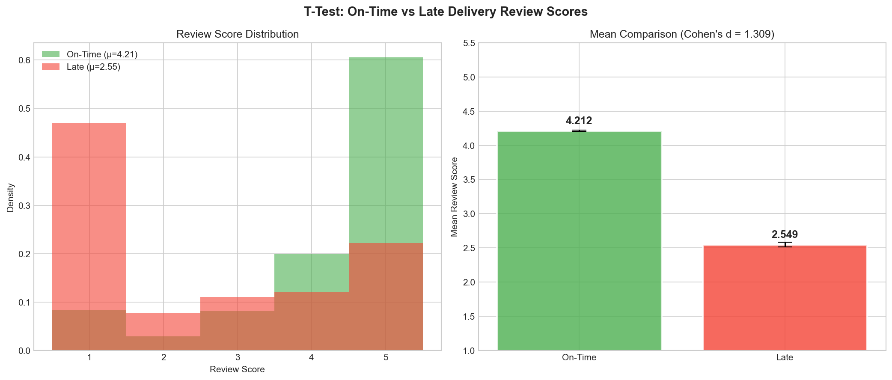
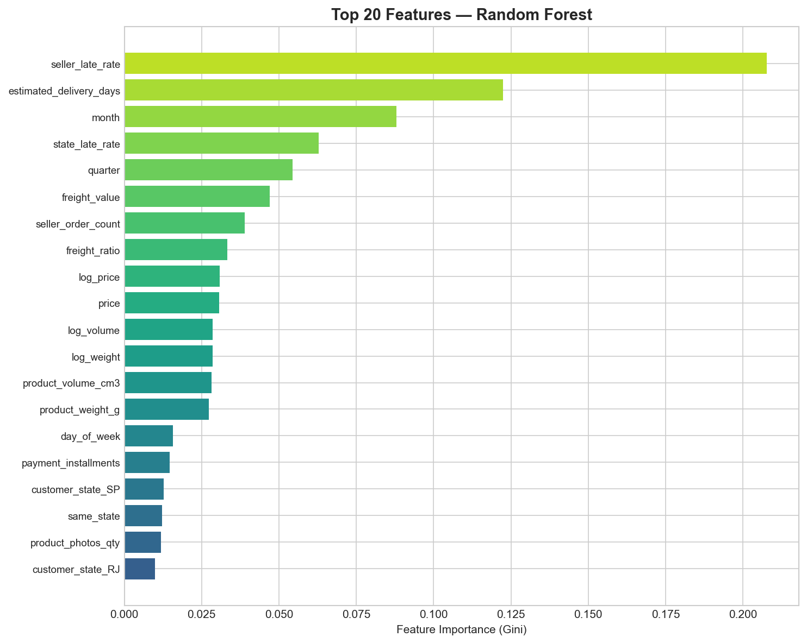
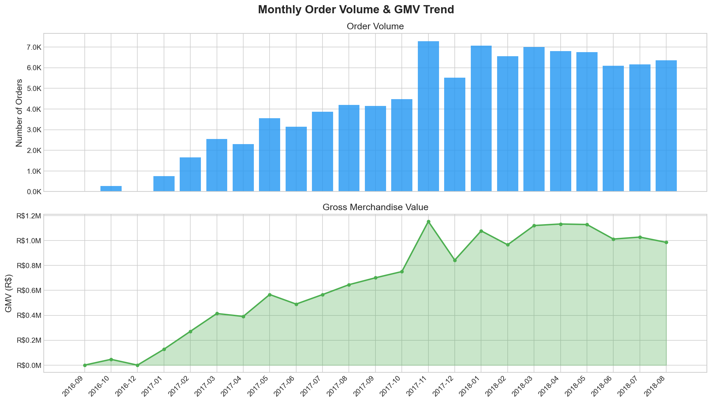

# 📊 E-Commerce Business Analytics & Delivery-Risk Prediction

A portfolio-grade business analytics project built on the **Olist Brazilian E-Commerce dataset** (~100K real orders). Demonstrates end-to-end data analysis skills: SQL data warehousing, Python EDA, statistical hypothesis testing, machine learning, and dashboard-ready outputs.

---

## 🎯 Executive Summary & Business Problem

**The Problem:** E-commerce platforms often struggle with customer retention and logistics management. Late deliveries cause customer churn, but predicting which orders will be late *before* they happen is difficult.

**The Solution:** This project analyzes 100,000+ real e-commerce orders to identify the root causes of delivery delays and customer dissatisfaction. 

**Key Outcomes:**
- Built an **automated ETL pipeline** to clean and load raw CSVs into a SQLite Star Schema.
- Used **SQL window functions** to perform RFM customer segmentation, identifying that a critically low 3% of customers drive repeat purchases.
- Used **Statistical Hypothesis Testing** to prove that late deliveries destroy customer satisfaction (dropping average review scores from 4.21 to 2.55).
- Trained a **Random Forest Machine Learning Model** (86.4% accuracy, 0.845 ROC-AUC) to proactively predict and flag high-risk late deliveries at checkout.

---

## 🏗️ Architecture

```
Raw CSVs (Olist — 9 files, ~100K orders)
   │
   ▼
Python ETL script (clean, join, validate, derive features)
   │
   ▼
SQLite Database — Star Schema
   ├── fact_orders         (grain: one row per order-item)
   ├── dim_customers       (unique customers with state/city)
   ├── dim_products        (products with English category names)
   ├── dim_sellers         (sellers with state/city)
   └── dim_date            (calendar dimension)
   │
   ▼
SQL Queries → Business Metrics Layer
   │
   ├──► Python scripts: EDA, statistical tests, ML model
   ├──► Power BI dashboard (via exported CSVs)
   └──► Business insights report
```

---

## 🔑 Key Skills Demonstrated

| Skill Area | What's Built |
|---|---|
| **SQL (Advanced)** | Star schema design, CTEs, window functions (NTILE, ROW_NUMBER, LAG), aggregations, multi-table joins |
| **Python (Pandas, NumPy)** | Data cleaning, feature engineering, visualization |
| **Statistics** | Pearson/Spearman correlation, independent t-test, one-way ANOVA, Cohen's d effect sizes |
| **Machine Learning** | Logistic Regression & Random Forest classifiers for delivery-delay prediction |
| **Data Visualization** | Matplotlib/Seaborn charts, Power BI dashboard |
| **Business Acumen** | KPI definition (GMV, AOV, delivery rate), RFM segmentation, actionable recommendations |

---

## 📁 Project Structure

```
ecommerce-business-analytics/
├── README.md                              ← You are here
├── requirements.txt                       ← Python dependencies
├── data/
│   ├── raw/                               ← Place Olist CSVs here
│   └── processed/                         ← ETL outputs + SQLite DB
├── sql/
│   ├── schema.sql                         ← Star schema DDL
│   └── queries/
│       ├── metrics.sql                    ← GMV, AOV, delivery rate, seller ranking
│       ├── rfm_segmentation.sql           ← RFM scoring with window functions
│       └── delivery_delay_analysis.sql    ← Delay root-cause analysis
├── scripts/
│   ├── etl.py                             ← ETL pipeline (CSV → SQLite)
│   ├── 01_eda.py                          ← Exploratory data analysis
│   ├── 02_statistical_tests.py            ← Hypothesis testing
│   └── 03_delivery_risk_model.py          ← ML classifier
├── dashboard/
│   ├── data/                              ← Pre-aggregated CSVs for Power BI
│   ├── screenshots/                       ← Dashboard screenshots
│   └── powerbi_guide.md                   ← Power BI build instructions
└── reports/
    ├── business_insights.md               ← Executive summary & recommendations
    ├── excel_guide.md                     ← Excel workbook instructions
    ├── figures/                            ← All generated charts
    ├── statistical_results.txt            ← Hypothesis test outputs
    └── model_results.txt                  ← ML model evaluation
```

---

## 🚀 Quick Start

### 1. Clone & Install

```bash
git clone https://github.com/YOUR_USERNAME/ecommerce-business-analytics.git
cd ecommerce-business-analytics
pip install -r requirements.txt
```

### 2. Download Dataset

Download the **Olist Brazilian E-Commerce Public Dataset** from [Kaggle](https://www.kaggle.com/datasets/olistbr/brazilian-ecommerce) and place all CSV files in `data/raw/`.

Expected files:
- `olist_customers_dataset.csv`
- `olist_orders_dataset.csv`
- `olist_order_items_dataset.csv`
- `olist_order_payments_dataset.csv`
- `olist_order_reviews_dataset.csv`
- `olist_products_dataset.csv`
- `olist_sellers_dataset.csv`
- `olist_geolocation_dataset.csv`
- `product_category_name_translation.csv`

### 3. Run ETL Pipeline

```bash
python scripts/etl.py
```

This creates the SQLite star-schema database at `data/processed/ecommerce.db` and exports cleaned CSVs.

### 4. Run SQL Queries

```bash
# Business metrics
sqlite3 -header -column data/processed/ecommerce.db < sql/queries/metrics.sql

# RFM segmentation
sqlite3 -header -column data/processed/ecommerce.db < sql/queries/rfm_segmentation.sql

# Delivery delay analysis
sqlite3 -header -column data/processed/ecommerce.db < sql/queries/delivery_delay_analysis.sql
```

### 5. Run Python Analysis

```bash
python scripts/01_eda.py                    # EDA + charts
python scripts/02_statistical_tests.py      # Statistical tests
python scripts/03_delivery_risk_model.py    # ML model
```

All charts saved to `reports/figures/`. Statistical and model results saved to `reports/`.

---

## 📈 Key Findings

- **GMV:** R$ 15.4M across 96.5K delivered orders (Sep 2016 – Oct 2018), with 24x monthly growth from launch
- **Delivery Performance:** 92.1% on-time rate; average 12.5 day delivery, with 9.4 day average delay for late orders
- **Review-Delay Correlation:** Statistically significant negative correlation (Pearson r = −0.229, p ≈ 0). On-time orders average 4.21 review score vs 2.55 for late — **1.66 point gap** (Cohen's d = 1.31, large effect)
- **Top Risk Factors:** Seller historical late rate (#1), estimated delivery days (#2), and month/seasonality (#3) identified as strongest predictors of late delivery
- **RFM Segments:** 16.2% of customers classified as "Champions" (30.4% of revenue), 8.0% as "At Risk" (R$ 816K revenue at stake). Repeat purchase rate is critically low at 3.0%
- **ML Model:** Random Forest classifier achieved 86.4% accuracy, 0.845 ROC-AUC, 0.603 recall for late-delivery prediction on held-out data

---

## 📊 Data Visualizations

Below are a few of the 15 charts generated automatically by the Python EDA and ML scripts:

### 1. Delivery Delay Destroys Customer Satisfaction (T-Test)


### 2. Random Forest Feature Importance


### 3. Monthly Order Volume & GMV


---

## 🎯 Highlights

- "Designed and built a SQL star-schema data warehouse from 100K+ e-commerce order records, defining and tracking key business metrics including R$15.4M GMV, R$160 AOV, and 3.0% repeat purchase rate."
- "Wrote SQL queries using window functions (NTILE, LAG, RANK) to perform RFM customer segmentation across 96K customers, identifying 8% classified as at-risk and 16% as Champions driving 30% of revenue."
- "Conducted statistical hypothesis testing (Pearson correlation, Welch's t-test, ANOVA) proving delivery delay significantly reduces review scores (Cohen's d = 1.31, large effect) with 12.8% of delivery variance explained by customer state."
- "Built a Random Forest classifier to predict delivery delay risk, achieving 86.4% accuracy and 0.845 ROC-AUC on held-out data, identifying seller performance as the #1 predictive feature."
- "Designed an interactive Power BI dashboard surfacing GMV, delivery performance, and category-level KPIs across 27 Brazilian states for stakeholder decision-making."

---

## 🛠️ Tech Stack

- **Database:** SQLite (portable; demonstrates same SQL skills as PostgreSQL/MySQL)
- **Python:** Pandas, NumPy, Matplotlib, Seaborn, SciPy, statsmodels, scikit-learn
- **Dashboard:** Power BI Desktop
- **Version Control:** Git/GitHub

---

## 📄 License

This project uses the publicly available [Olist Brazilian E-Commerce Dataset](https://www.kaggle.com/datasets/olistbr/brazilian-ecommerce) under its original license terms.
